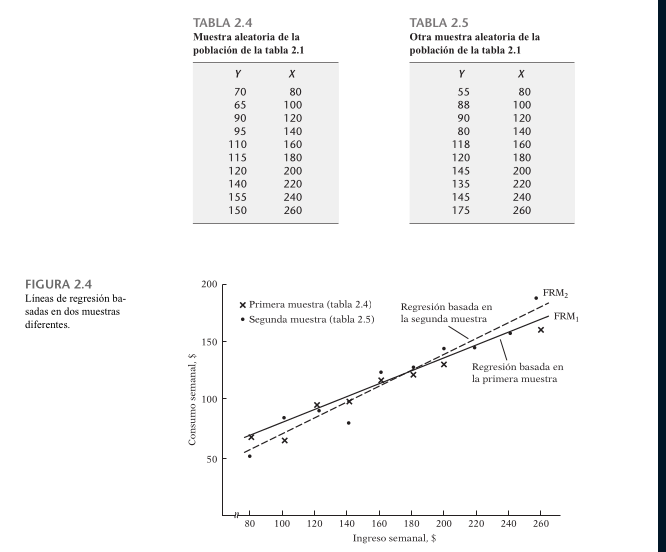

#+TITLE: Analisis de regresion con dos variables: algunas ideas basicas.
#+SUBTITLE: Damadar Gujarati notes
#+DATE: <2026-06-09 Tue>

El analisis de regresion con dos variables se enfoca en la relacion entre una variable dependiente y una variable explicativa, con el objetivo de estimar o predecir el valor promedio de la variable dependiente en funcion de los valores conocidos de la variable explicativa.

El analisis de regresion bivariable se puede representar mediante la ecuacion:

$$Y = \beta_{0} + \beta_{1}X + \epsilon$$

donde $Y$ es la variable dependiente, $X$ es la variable ecplicativa, $\beta_{0}$ es ek intercepto, $\beta_{1}$ es el coeficiente de regresion y $\epsilon$ es el error aleatorio. El objetico es encontrar los valores de $\beta_{0}$ y $\beta_{1}$ que minimicen la suma de los cuadrados de los errores.

En el ejemplo hipotetico presentado, se tienen 60 familias con ingresos semanales ($X$) y gastos de consumo semanales ($Y$) en dolares.

La ecuacion de regresion se puede estimar mediante el metodo de los minimos cuadrados, que busca minimizar la suma de los cuadrados de los errores:

$$S = \sum_{}_{i=1}^{n }(Y_{i} - \beta_{0} - \beta_{1}X_{i}_{})^{2}$$

donde $n$ es el numero de observaciones. Al tomar las derivadas parciales de $S$ con respecto a $\beta_{0}$ y $\beta_{1}$ y estabñecerlas iguales a cero, se pueden obtener las ecuaciones normales:

$$\sum_{i=1}^{n} Y_{i} = n\beta_{0} + \beta_{1} \sum_{i=1}^{n} X_{i}$$

$$\sum_{i=1}^{n} X_{i}Y_{i} = \beta_{0} \sum_{i=1}^{n} X_{i} + \beta_{1} \sum_{i=1}^{n} X_{i}^{2}$$

Resolviendo este tema de ecuaciones, se pueden obtener los estimadores de $\beta_{0}$ y $\beta_{1}$.

El analisis de regresion es una tecnica estadistica ampliamente utilizada en diversas disciplinas, como la economia, la sociologia, la psicologia y la medicina. Algunos autores clave en el desarrollo de la regresion lineal son Karl Pearson, Francis Galton y Ronald Fisher. En la actualidad, el analisis de regresion se utiliza en una variedad de aplicaciones, desde la prediccion de resultados en la medicina hasta la evaluacion de politicas economicas.

* Concepto de funcion de regresion (FRP)

La funcion de regresion poblacional (FRP) describe la relacion funcional entre la media condicional de una variable dependiente Y yna variable explicativa X, y se puede representar mediante la ecuacion $E(Y | X_{i}) = f(x_{i})$

La funcion de regresion poblacional se define como la esperanza condicional de la varivale dependiente Y dado un valor especifico de la variable explicativa X, es decir $E(Y | X_{i})$. Esta funcion se puede representar de la siguiente manera:

$$E(Y | X_{i}) = f(X_{i})$$

donde $f(X_{i})$ denota una funcion de la variable explicativa X. Un ejemplo comun es la funcion lineal donde la relacion entre la media condicional y la variable explicativa se puede representar mediante la ecuacion:

$$E(Y | X_{i}) = \beta_{1} + \beta_{2}X_{i}$$

donde  $\beta_{1}$ y $\beta_{2}$ son parametros no conocidos pero fijos decir, depende de la naturaleza de los datos y no se puede determinar a priori. Sin embargo en algunos casos, la teoria puede proporcionar alguna guia sobre la forma que puede adoptar la funcion. Por ejemplo, en economia, se puede supone que el consumo tiene una relacion lineal con el ingreso, lo que lleva a la ecuacion:

$$E(Y | X_{i}) \beta_{1} + \beta_{2}X_{i}$$
donde $Y$ es el consumo y $X_{i}$ es el ingreso.

La funcion de regresion poblacional es un concepto fundamental en la estadistica y la econometria. La idea de modelar la relacion entre variables fue introducida por primera vez por Carl Friedrich Gauss y Pierre-Simon Laplace en el siglo XIX. Sin embargo, no fue hasta el siglo XX que la funcion de regresion poblacional se convirtio en un tema de estudio importante en la estadistica y la econometria.

Algunos autores clave en el desarrollo de la teoria de regresion incluyen:

- Carl Friedrich Gauss: quien introdujo el concepto de regresion lineal.
- Pierre-Simon Laplace: quien trabajo en la teoria de la regresion lineal.
- Jan Tinbergen: quien aplico la regresion lineal en la economia y desarrollo la teoria de la regresion multiple.

EL debate actual en la literatura se centra en la seleccion de modleos, la validacion de supuestos y la interpretacion de los resultados. Ademas, la creciente disponibilidad de datos y la capacidad de procesamineto han llevado al desarrollo de nuevos metodos y tecnicas para la regresion, como la regresion no lineal y la regresion conrestricciones.

** Significado del termino lineal

El termino "lineal" en modelos de regresion se interpreta de dos formas: linealidad en las variables explicativas y linealidad en los parametros, siendo esta ultima la pertinente para el desarrollo de la teoria de regresion.

*** Linealidad en las variables

Linealidad es aquel en que la esperanza condicional de /Y/ es una funcion lineal /$X_{n}$/. Geometricamente la curva de regresion en este caso es una recta. En esta interpretacion, una funcion de regresion como $E(Y | X_{i}) = \beta_{1} + \beta_{2}X_{i}^{2}$ no es una funcion lineal porque la variable X aparece elevada a una potencia o indice de 2.

Un ejemplo concreto es el modelo $E(Y|X_{i}) = \beta_{1} + \beta_{2} X_{i}^{2}$. Si $X_{i} = 3$, entonces $E(Y|X_{i}) = \beta_{1} + 9\beta_{2}$, que es una función lineal en $\beta_{1}$ y $\beta_{2}$. Sin embargo, el modelo $E(Y|X_{i}) = \beta_{1} + \beta_{2}^{2} X_{i}$ no es lineal en los parámetros, ya que $E(Y|X_{i} = 3) = \beta_{1} + 3\beta_{2}^{2}$.

En resumen, La linealidad en los parametros es una condicion necesaria para que un modelo de regresion sea considerado lineal. Esto se puede representar esquematicamente como:

- $E(Y|X_i) = \beta_1 + \beta_2 X_i$: lineal en los parámetros y en las variables
- $E(Y|X_i) = \beta_1 + \beta_2 X_i^2$: lineal en los parámetros, pero no lineal en las variables

*** Linealidad en los parametros

Esta se presenta cuando la esperanza condicional de /Y/, $E(Y|X_{i})$, es una funcion lineal de los parametros, los \beta; puede ser o no lineal en la variable /X/. De acuerdo con la interpretacion, /$E(Y|X_{i}) = \beta_{1} + \beta_{2}X_{i}^{2}$/ es un modelode regresion lineal (en el parametro). Para ver lo anterior supongamos que /X/ tiene un valor de 3. Por tanto, /E(Y|X = 3) = \beta_{1} + 9\beta_{2}/, ecuacion a todas luces lineal en $\beta_{1}$ y $\beta_{2}$.

En concepto de linealidad en los parametros es fundamental en la teoria de regresion lineal, ya que permite el desarrollo de tecnicas estadisticas y economicas para analizar predecir relaciones entre variables. Los autores clave en este campo incluyen a Carl Friedrich Gauss y Pierre-Simon Laplace, quienes sentaron las bases para la teoria de regresion lineal. El debate actual se centra en la aplicacion de tecnicas de regresion no lineal y la importancia de considerar la linealidad en los parametros en modelos de regresion.

** Especidficacion estocastica de la FRP.

La relación entre el consumo familiar y el ingreso no es determinística, sino que presenta una variabilidad estocástica, lo que implica que el consumo de una familia no aumenta necesariamente con el aumento del ingreso.

La ecuación (2.4.1) expresa que el gasto de una familia se puede descomponer en dos componentes: uno sistemático, que es la media del consumo de todas las familias con el mismo nivel de ingreso, y otro aleatorio, que es el término de perturbación estocástica.

La ecuación (2.4.1) se puede escribir como:
$$Y_i = E(Y | X_i) + u_i$$
donde $Y_i$ es el gasto de la familia $i$, $E(Y | X_i)$ es la media del consumo de todas las familias con el mismo nivel de ingreso $X_i$, y $u_i$ es el término de perturbación estocástica.

Si suponemos que $E(Y | X_i)$ es lineal en $X_i$, como en la ecuación (2.2.2), entonces la ecuación (2.4.1) se puede escribir como:
$$Y_i = \beta_1 + \beta_2 X_i + u_i$$
donde $\beta_1$ y $\beta_2$ son parámetros que se deben estimar.

La ecuación (2.4.2) plantea que el consumo de una familia se relaciona linealmente con su ingreso más el término de perturbación. Por ejemplo, si el ingreso de una familia es $X_i = 80$, entonces el consumo se puede expresar como:
$$Y_i = \beta_1 + \beta_2 (80) + u_i$$

Tomando el valor esperado de la ecuación (2.4.1) en ambos lados, obtenemos:
$$E(Y_i | X_i) = E[E(Y | X_i)] + E(u_i | X_i)$$
donde se aprovecha que el valor esperado de una constante es la constante misma.

La ecuación (2.4.1) es un modelo de regresión lineal que se utiliza comúnmente en econometría y estadística para analizar la relación entre una variable dependiente (en este caso, el gasto de una familia) y una variable independiente (en este caso, el ingreso de la familia). Autores clave en este campo incluyen a Gauss, Legendre y Galton, quienes desarrollaron los fundamentos de la regresión lineal.

En el contexto de la regresión lineal, el modelo se puede representar como:

$$Y = \beta_0 + \beta_1 X + u$$

donde $Y$ es la variable dependiente, $X$ es la variable independiente, $\beta_0$ y $\beta_1$ son los parámetros del modelo y $u$ es el término de perturbación estocástica. El término $u$ se puede descomponer en:

$$u = \sum_{i=2}^k \beta_i X_i + \varepsilon$$

donde $\varepsilon$ es un error aleatorio y $X_i$ son variables omisiones o no explicadas en el modelo.

El término de perturbación estocástica $u$ es importante porque permite capturar la variabilidad residual que no se puede atribuir a las variables incluidas en el modelo. Esto se debe a que, en la práctica, es común que no se disponga de información completa sobre todas las variables que afectan a la variable dependiente.

Por ejemplo, si se quiere modelar el consumo familiar $Y$ en función del ingreso familiar $X$, el término de perturbación estocástica $u$ podría incluir variables como la riqueza familiar, el número de hijos, la educación, etc.

$$Y = \beta_0 + \beta_1 X + u$$

donde $u$ podría ser:

$$u = \beta_2 \text{riqueza} + \beta_3 \text{número de hijos} + \beta_4 \text{educación} + \varepsilon$$

El término de perturbación estocástica es un concepto fundamental en la econometría y la estadística, y se utiliza en una variedad de campos, incluyendo la economía, la finanza, la medicina y la ciencia social.

El debate actual en torno al término de perturbación estocástica se centra en la importancia de considerar la estructura de la variabilidad residual en el modelo, y en la necesidad de desarrollar métodos estadísticos que permitan capturar la complejidad de la relación entre las variables.

1. Vaguedad de la teoría: De existir una teoría que determine el comportamiento de $Y$, podría estar incompleta, y con frecuencia lo está. Se tendría quizás la certeza de que el ingreso semanal $X$ afecta el consumo semanal $Y$, pero también ignoraríamos, o no tendríamos la seguridad, sobre las demás variables que afectan a $Y$. Por consiguiente, $u_i$ sirve como sustituto de todas las variables excluidas u omitidas del modelo.

  2. Falta de disponibilidad de datos: Aunque se conozcan algunas variables excluidas y se considerara por tanto una regresión múltiple en lugar de una simple, tal vez no se cuente con información cuantitativa sobre esas variables. Es común en el análisis empírico que no se disponga de los datos que idealmente se desearía tener. Por ejemplo, en principio se puede introducir la riqueza familiar como variable explicativa adicional a la variable ingreso para explicar el consumo familiar. Pero, por desgracia, la información sobre riqueza familiar por lo general no está disponible. Así, no habría más que omitir la variable riqueza del modelo a pesar de su gran relevancia teórica para explicar el consumo.

    3. Variables centrales y variables periféricas: Suponga en el ejemplo consumo-ingreso que además del ingreso $X_1$ hay otras variables que afectan también el consumo, como el número de hijos por familia $X_2$, el sexo $X_3$, la religión $X_4$, la educación $X_5$ y la región geográfica $X_6$. Pero es muy posible que la influencia conjunta de todas o algunas de estas variables sea muy pequeña, o a lo mejor no sistemática ni aleatoria, y que desde el punto de vista práctico y por consideraciones de costo no se justifique su introducción explícita en el modelo. Cabría esperar que su efecto combinado pueda tratarse como una variable aleatoria $u_i$.

      4. Aleatoriedad intrínseca en el comportamiento humano: Aunque se logre introducir en el modelo todas las variables pertinentes, es posible que se presente alguna aleatoriedad “intrínseca” en $Y$ que no se explique, a pesar de todos los esfuerzos que se inviertan. Las perturbaciones, $u$, pueden reflejar muy bien esta aleatoriedad intrínseca.

        5. Variables representantes (proxy) inadecuadas: A pesar de que el modelo clásico de regresión (que veremos en el capítulo 3) supone que las variables $Y$ y $X$ se miden con precisión, en la práctica, los datos pueden estar plagados de errores de medición. Consideremos, por ejemplo

** Funcion de regresion muestral (FRM)

Hasta el momento, nos hemos limitado a la población de valores Y que corresponden a valores fijos de X. Con toda deliberación evitamos consideraciones muestrales (observe que los datos de la tabla 2.1 representan la población, no una muestra). No obstante, es momento de enfrentar los problemas muestrales, porque en la práctica lo que se tiene al alcance no es más que una muestra de valores de Y que corresponden a algunos valores fijos de X. Por tanto, la labor ahora es estimar la función de regresión poblacional (FRP) con base en información muestral.

A manera de ilustración, supongamos que no se conocía la población de la tabla 2.1 y que la única información que se tenía era una muestra de valores de Y seleccionada al azar para valores dados de X como se presentan en la tabla 2.4. A diferencia de la tabla 2.1, ahora se tiene sólo un valor de Y correspondiente a los valores dados de X; cada Y (dada $X_i$) en la tabla 2.4 se selecciona aleatoriamente de las Y similares que corresponden a la misma $X_i$ de la población de la tabla 2.1.

#+CAPTION: Figura 2.4 Lineas de regresion basadas en dos muestras diferentes

---

* Navega al siguiente capitulo

[[file:../03_estimacion_dos_variables/03_estimacion_dos_variables.org][Ir al Capitulo 3]]
